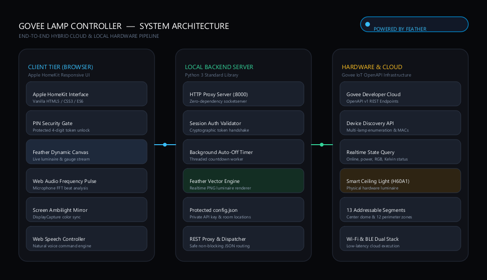
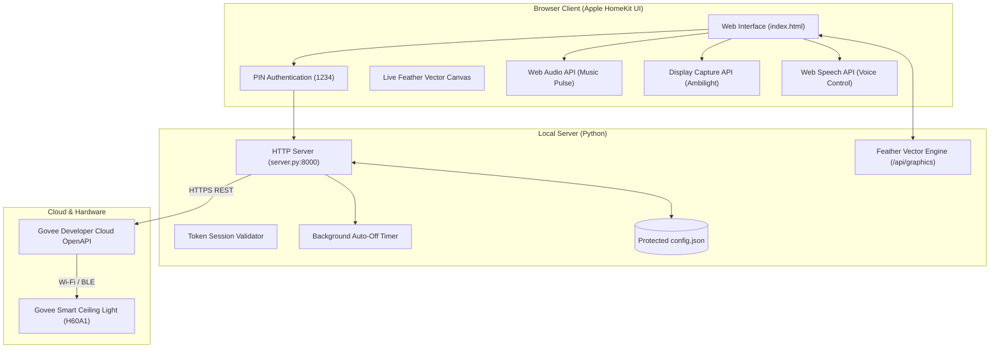

# Govee Smart Lamp Controller (Web Edition)

A minimalist, responsive web controller for Govee smart lights (supporting single and multi-device setups) built with vanilla web technologies and Python's standard library.

## Features
- **Multi-Lamp Menu:** Automatically discovers all lamps connected to your Govee account with room location tags.
- **Custom Room Locations:** Label where each lamp is (e.g. "Living Room", "Bedroom", "Office") with 1-click editing that saves to `config.json`.
- **Protected Architecture:** Your Govee API key and MAC addresses remain protected on the Python backend — never exposed to visitors or browser inspection.
- **PIN Access Protection:** Locks control behind a custom PIN code (default: `1234`).
- **Quick Scene Presets:** Instant 1-click lighting scenes (Focus, Reading, Relax, Night Light).
- **Auto-Off Timer:** Server-side countdown timer (15m, 30m, 60m) that runs even when your browser is closed.
- **Music Beat Pulse:** Real-time Web Audio API frequency visualizer that pulses light colors or brightness to music beats.
- **Screen Ambilight Mirror:** Dynamically samples your PC monitor colors in real time and synchronizes the ceiling light.
- **Browser Voice Commands:** Hands-free control ("turn on", "turn off", "reading", "focus", "brighter", "dimmer", etc.).
- **Dynamic Vector Graphics:** Real-time architectural fixture visualization and precision gauge powered by [Feather](https://github.com/Yannis-A-D/feather) rendering engine.
- **Zero External Dependencies:** Built with Python standard library and vanilla web APIs. Seamlessly integrates with [Feather](https://github.com/Yannis-A-D/feather) when available.

## System Architecture & Structure

<p align="center">
  
</p>



### Directory Structure

```text
govee-lamp-controller/
├── index.html        # Apple HomeKit responsive interface & Web APIs
├── server.py         # Python proxy server & Feather graphics renderer
├── config.json       # Protected credentials & room tags (Git-ignored)
├── start.bat         # 1-click Windows quick launcher
├── .gitignore        # Prevents credential leakage
└── README.md         # Documentation & setup guide
```

## Setup & Configuration

1. Create or edit `config.json`:
   ```json
   {
     "govee_api_key": "YOUR_GOVEE_API_KEY",
     "access_pin": "1234",
     "device_locations": {
       "60:AD:D0:C9:07:88:44:D4": "Ceiling / Main Room"
     }
   }
   ```
   *(Note: `config.json` is included in `.gitignore` so your private key won't be pushed to GitHub.)*

2. **Run the Controller:**
   - Double-click `start.bat` (or run `py server.py` in your terminal).
   - Open `http://localhost:8000` in any browser.
   - Enter your PIN `1234`.

3. **Remote Access:**
   - Open the project in VS Code, go to the **Ports** tab, forward port `8000`, and set visibility to **Public** to access it from your phone or friends' devices anywhere in the world.
